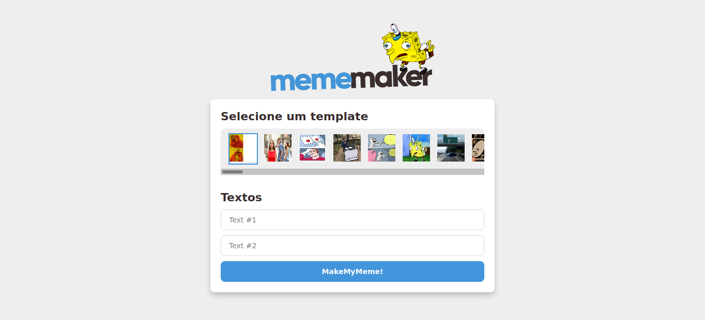

# MemeMaker



## About :clipboard:

This project was carried out during [Mateus Silva](https://www.youtube.com/watch?v=Yajip86C8sg) video class. In this project, I was able to review several **React** concepts with styled components.

## How to configure :rocket:

**Clone repository**

```
 $ git@github.com:CleytonRR/mememaker-react.git

```

**Change to Directory**

```
  $ cd mememaker-react
```

**Install dependencies**

```
  $ yarn
```

## Run :fire:

In directory run

```
  $ yarn start
```

## Technologies :clipboard:

- [React](https://pt-br.reactjs.org/) - A JavaScript library for building user interfaces
- [styled-components](https://styled-components.com/) - Used to write css in javascript file
